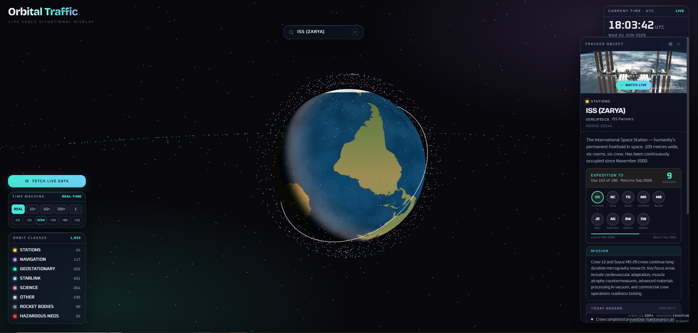

# Orbital Traffic 🛰️

Real-time 3D satellite and near-Earth object tracker. 18,000+ tracked objects, 55 hazardous asteroids, live crew data — all positions computed in your browser.

**Live at [orbitaltraffic.app](https://orbitaltraffic.app)** · Installable as a PWA on iOS, Android and desktop.



## Features

- **3D Earth globe** with live positions for every catalogued satellite — Starlink, ISS, GPS/Galileo/GLONASS, geostationary, science, classified, debris
- **55 hazardous near-Earth objects** with heliocentric orbit propagation
- **Time Machine** — scrub forward/backward through orbital history at up to 300×
- **Live telemetry** — altitude, speed, ground point, orbit class, sunlight state, region overflown
- **ISS & Tiangong crew cards** — who's aboard right now, mission progress, and a daily "Today aboard" activity feed
- **Curated descriptions** for 700+ notable objects, with NASA imagery
- **Works offline** after first load; catalog data refreshes daily

## How it's put together

```
orbital-traffic/
├── apps/web/           Vite-built PWA (three.js + satellite.js)
│   ├── public/data/    Satellite/NEO catalog as versioned JSON (refreshed daily by CI)
│   └── src/            ES modules: scene/, astro/, data/, ui/
├── packages/catalog/   Shared TLE parsing + classification (single source of truth)
├── worker/             Cloudflare Worker: /tle /crew /today edge-cached proxies
├── tools/              Node data pipeline (TLE refresh, ISS daily log)
└── .github/workflows/  CI, Pages deploy, daily data refresh
```

The same classification pipeline (`packages/catalog`) runs everywhere a record enters the
system — web app ingest, Worker `/tle` responses, and the daily data refresh — so an object
is never categorized three different ways by three different code paths.
See [docs/ARCHITECTURE.md](docs/ARCHITECTURE.md) for the full picture.

## Development

```bash
npm install
npm run dev        # Vite dev server at http://localhost:5173
npm test           # vitest — catalog + worker suites
npm run lint       # eslint across the monorepo
npm run build      # production build → apps/web/dist
```

Node ≥ 20 required. No other toolchain — the data pipeline is Node too.

### Refreshing data locally

```bash
npm run data:tle        # rewrite apps/web/public/data/satellites.json from CelesTrak
npm run data:iss-today  # rewrite iss-today.json from NASA's station blog
```

Both run daily in CI ([refresh-tle-data](.github/workflows/refresh-tle-data.yml),
[update-iss-today](.github/workflows/update-iss-today.yml)) and commit only when
something changed.

### Deploying

- **Web app** — pushed to `main`, built and deployed to GitHub Pages by
  [deploy-pages.yml](.github/workflows/deploy-pages.yml). One-time setup: repo
  **Settings → Pages → Source → GitHub Actions**. The custom domain is
  `apps/web/public/CNAME`.
- **Worker** — `npm run deploy -w worker` (needs `wrangler login`). See
  [worker/README.md](worker/README.md).

## Data sources

| Data | Source | Refresh |
|------|--------|---------|
| Satellite TLEs | [CelesTrak](https://celestrak.org) | Worker: 20 min edge cache · bundled catalog: daily |
| Object metadata | CelesTrak SATCAT | on selection, browser-cached |
| NEO elements | NASA/JPL SBDB | bundled |
| Crew roster | [Open Notify](http://open-notify.org) | 1 h edge cache |
| ISS activity | [NASA space station blog](https://blogs.nasa.gov/spacestation/) | daily |

Orbital data is for informational use only.

## License

[MIT](LICENSE)
